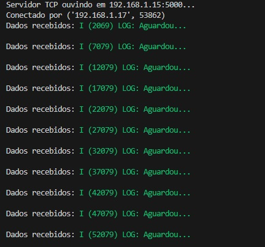
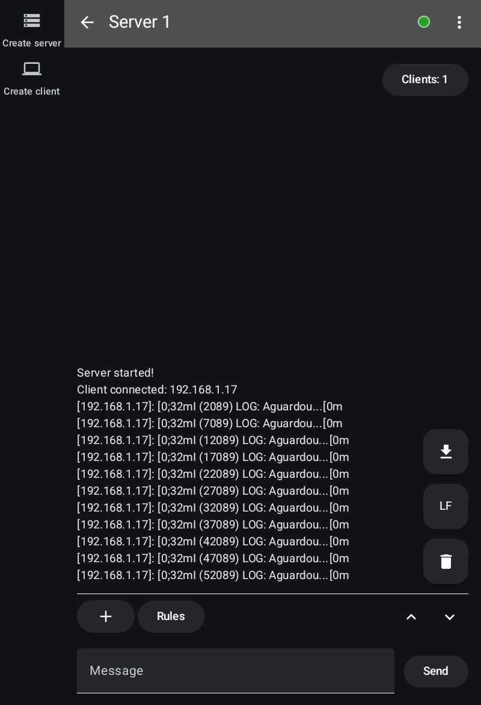

# ESP Remote Logging Example

Este projeto demonstra como conectar um dispositivo ESP a uma rede Wi-Fi, estabelecer uma conexão TCP e enviar logs de forma remota para um servidor. Ele serve como um exemplo básico, mas pode ser adaptado para outros protocolos de comunicação, como UDP, MQTT, etc.

## Como Funciona

1. **Conexão Wi-Fi**: O ESP se conecta a uma rede Wi-Fi usando as credenciais configuradas no código.
2. **Conexão TCP**: Após conectar-se à rede, o ESP estabelece uma conexão TCP com um servidor, utilizando o IP e a porta configurados.
3. **Envio de Logs**: Os logs gerados no ESP são enviados para o servidor via TCP. Eles também podem ser exibidos localmente no terminal do ESP.

## Scripts Python para Testes

Dois scripts Python estão incluídos para testar a funcionalidade:

- **`socket_server.py`**: Atua como um servidor TCP para receber os logs enviados pelo ESP. Atualize a variável `HOST` com o IP correto da sua máquina.
- **`socket_client.py`**: Um cliente TCP simples para enviar mensagens de teste ao servidor.

### Exemplo de Uso

1. Execute o script `socket_server.py` no seu PC para iniciar o servidor:
   ```sh
   python socket_server.py
   ```
2. Configure e carregue o código no ESP, garantindo que ele se conecte à mesma rede Wi-Fi do seu PC.
3. O ESP enviará os logs para o servidor, que serão exibidos no terminal onde o script `socket_server.py` está rodando.

### Exemplos de Logs

Abaixo estão imagens de exemplo mostrando os logs recebidos em um PC e em um celular:

- `Logs no PC`:
<div align="center">
  
</div>

- `Logs no Phone`:
<div align="center">
  
</div>

## Observações

- Certifique-se de que o endereço IP no `socket_server.py` corresponde ao IP da máquina onde o script está sendo executado.
- O IP e a porta para a conexão TCP do ESP são configurados no arquivo `main.c`.
